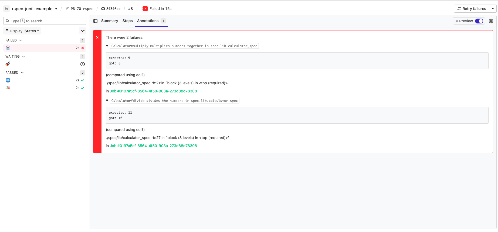

# Buildkite RSpec JUnit Example

[](https://buildkite.com/buildkite/rspec-junit-example-1/builds/latest?branch=main)
[](https://buildkite.com/new)

This repository is an example [Buildkite](https://buildkite.com/) pipeline that collects JUnit test failures from [RSpec](https://rspec.info/) and annotates the build with the [`buildkite-agent annotate`](https://buildkite.com/docs/agent/v3/cli-annotate) command.

👉 **See this example in action:** [buildkite/rspec-junit-example](https://buildkite.com/buildkite/rspec-junit-example-1/builds/latest?branch=main)

See the full [Getting Started Guide](https://buildkite.com/docs/guides/getting-started) for step-by-step instructions on how to get this running, or try it yourself:

[](https://buildkite.com/new)

<a href="https://buildkite.com/buildkite/rspec-junit-example-1/builds/latest?branch=main">
  
</a>


<!-- docs:start -->

## How it works

This example demonstrates how to:
- Run RSpec tests that produce JUnit XML output
- Parse the JUnit report for failed tests
- Use the `buildkite-agent annotate` command to display those failures directly in the Buildkite UI

The annotation helps you quickly identify failing tests without digging through logs.

Test annotations use 2 features within Buildkite:

1. The `buildkite-agent annotate` command that allows you add arbiraty HTML and
   Markdown to the top of a build page
2. A wait step with `continue_on_failure: true` which tells the pipeline to
   continue in the event of a failed step

The `pipeline.yml` file can be seen here:
https://github.com/buildkite/rspec-junit-example/blob/master/.buildkite/pipeline.yml

Here's the first step:

```yaml
- label: ":rspec:"
  artifact_paths: "tmp/rspec-*.xml"
  commands:
    - "bundle"
    - "rspec --format progress --format RspecJunitFormatter --out tmp/rspec-$BUILDKITE_JOB_ID.xml"
  plugins:
    - docker#v1.0.0:
        image: "ruby:2.4"
        workdir: /app
```

This step runs our "rspec" command within a Ruby docker container, and stores
the JUnit XML data to an artifact at
"tmp/rspec-f59b96d7-5d75-42a6-ab9b-d4cea59db2b2.xml"

The next step:

```yaml
 - wait: ~
   continue_on_failure: true
```

Tells Buildkite that if there's a failure in the previous stage of the pipeline
(in this case, the "RSpec" tests) that it should continue the pipeline.
Usually, the `wait` step will fail the pipeline at this point since there was
an error - but this option changes that behaviour.

```yaml
- label: ":junit:"
  commands:
    - .buildkite/junit.sh
```

The last step is the one that parses our JUnit XML files, and turns them into a
Buildkite annotation. Here's the script that creates the actual annotation:

```bash
#!/bin/bash

set -euo pipefail

mkdir -p tmp

echo "--- :junit: Download the junits"
buildkite-agent artifact download tmp/rspec-*.xml tmp

echo "--- :junit::ruby: Processing the junits"
docker run --rm -v "$(pwd):/app" ruby:2.4 bash -c "cd /app && gem install nokogiri --quiet --silent && ruby /app/.buildkite/lib/junit.rb /app/tmp/*.xml" > tmp/annotation.md

echo "--- :buildkite: Creating annotation"
buildkite-agent annotate --context junit --style error < tmp/annotation.md
```

We wrote our JUnit XML parser in Ruby (you can write it in what ever language
you like), but all it does it parse all the `rspec-*.xml` files, grabs the
errors, and turns it some HTML that looks like this:

```html
<p>There were 3 failures:</p>

<details>
<summary><code>Calculator#multiply multiplies numbers together in spec.lib.calculator_spec</code></summary>

<code><pre>expected: 8
     got: 6

(compared using eql?)

./spec/lib/calculator_spec.rb:21:in `block (3 levels) in '</pre></code>

in <a href="#f59b96d7-5d75-42a6-ab9b-d4cea59db2b2">Job #f59b96d7-5d75-42a6-ab9b-d4cea59db2b2</a>
</details>

...
</div>
```

We then pipe that HTML into the `buildkite-agent annotate` command and change
the style of annotation to `error` so it shows up as red and with a cross in
the Buildkite UI.


```yaml
- wait

- command: ".buildkite/deploy.sh"
  label: ":rocket:"
```

The final 2 steps demonstrate that the pipeline doesn't continue any further
since there was an error in one of the previous stages. If this wait step also
had `continue_on_failure: true` then it would also continue.

<!-- docs:end -->

## License

See [LICENSE.md](LICENSE.md) (MIT)
